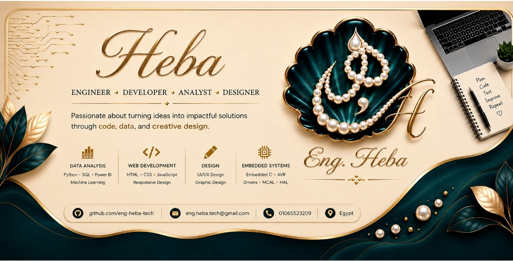

  

�

�
Load image
�

👩‍💻 Hi, I'm Heba 👋
Engineer · Developer · Analyst · Designer
Passionate about turning ideas into impactful solutions through code, data, and creative design.
🧠 About Me
🎓 Engineer specialized in Embedded Systems, Data Analysis, Web Development, and UI/Graphic Design
🐍 Experienced in Python, SQL, Power BI, and Machine Learning
🌍 Based in Egypt
📫 Reach me at: eng.heba.tech@gmail.com
🛠️ Tech Stack
📊 Data Analysis & Machine Learning
�
�
�
�
�
�
Load image
Load image
Load image
Load image
Load image
Load image
🌐 Web Development
�
�
�
�
Load image
Load image
Load image
Load image
⚙️ Embedded Systems
�
�
Load image
Load image
🚀 Featured Projects
📊 Data Analysis & Machine Learning
Project
Description
Tools
🛒 Retail Sales Analytics
End-to-end sales analysis for 2,000+ transactions with KPI dashboard, trend analysis & Excel report
Python · Pandas · SQL · Matplotlib
🏥 Heart Disease Prediction
ML pipeline predicting heart disease risk using 3 models — Random Forest achieved AUC = 1.0
Python · Scikit-Learn · EDA
🌐 Web Development
Project
Description
Tools
🌿 Al Azhar Herbal Store
Frontend web app for an online herbal store with responsive design
HTML · CSS · JavaScript · Netlify
⚙️ Embedded Systems
Project
Description
Tools
🔧 HAL Drivers
HAL drivers for peripherals: CLCD, Keypad, Stepper Motor
Embedded C · AVR
⚙️ MCAL Drivers
MCAL drivers for AVR microcontrollers
Embedded C · AVR
🎓 Graduation Project
Embedded Systems project with Arduino, Proteus simulations & IoT
Embedded C · IoT
📈 GitHub Stats
�

�
Load image
�
Load image
�

📫 Contact
�

�
�
�
Load image
Load image
Load image
�

�

⭐ If you find my work useful, don't forget to star the repositories!
�
